### 1. Project name: Learning Web API

### 2. Period : 1 week

### 3. Concept of API

- API: Application Programming Interface. API is protocol to get correct output when operated UI such as clicking button no matter what we don't know logic of offered OS or offered backend service in detail. In addition, offered function format is also one of API.

  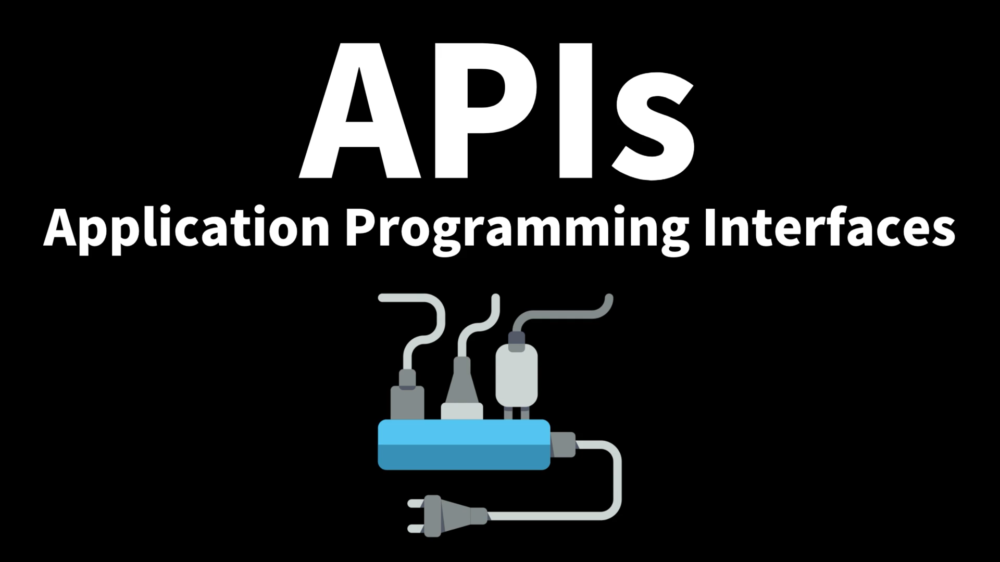

  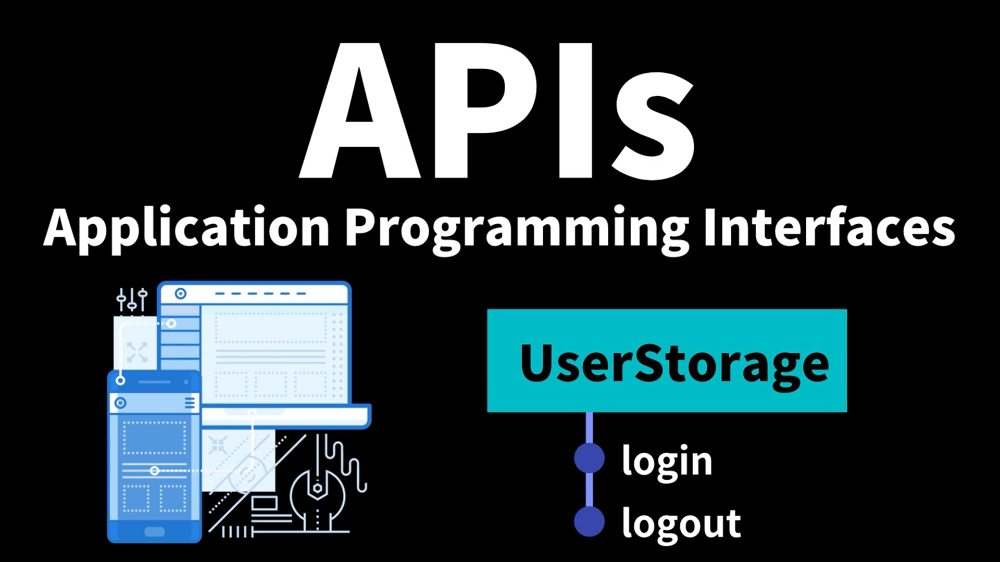

- Web API : offered browser has a variety of APIs. Please refer https://developer.mozilla.org/en-US/docs/Web/API. Https is communication protocol with encrypted security.

  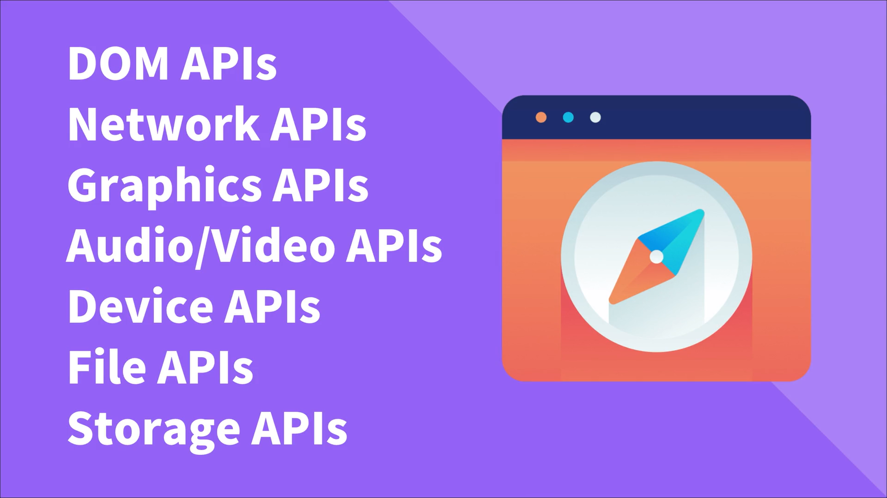

  

### 4. Architecture diagram of browser

- Browser is divided to 'Window', 'Document', 'Navigator'. Please refer `console.log(window);` on console of browser or https://developer.mozilla.org/en-US/docs/Web/API/Window.

  

  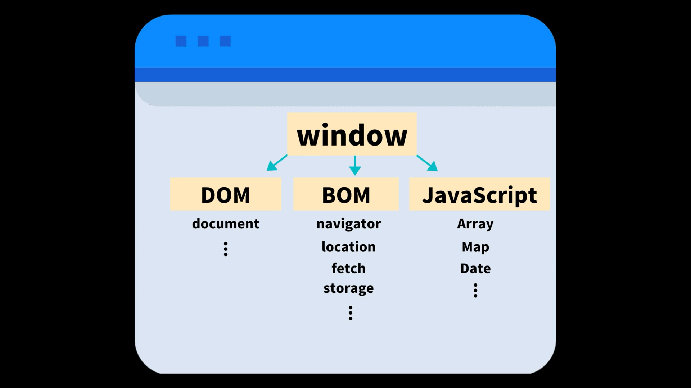

- alert() and window.alert() are operated with same output because window is global object. In addition, `console.log(window)` and `console.log(this)` are also operated with same output.

### 5. Window size

- window.screen is size of monitor.
  window.outer is size of browser with URL and tap.
  window.inner is size of displayed page with scroll bar.
  document.documentElement is size of displayed page without scroll bar.

- In case of decorating page, Use CSS generally. However, in case of decorating some of simple comment,
  Use style tag of HTML instead of CSS as below. Please refer README_CSS for good understanding regarding decorating in detail.

- ``

- In case you want to operate reactive values, use application and querySelector as below. The values would be changed according to changed size of browser, such as changed window size, outer size, inner size, documentElement size. These means event values. Use function named `updateTag` to load event values on first page. Function named `addEventListener` use callback function `{}` within addEventListener to update event values per event. In addition, arrow function is used within addEventListener. `tag.innerHTML` means new element of HTML is put in tag.

- `<body>`
  `
` Window_size `
`
  ``
  `</body>`

- In case of all codes, Please refer file named `window-size.html`.

### 6. Coordinate

#### 6-1. Default coordinate

- Element.getBoundingClientRect(): Object named Element has function of API regarding coordinate. Element includes all of DOM on browser, such as tag of image and text and so on.

- Top of getBoundingClientRect() is same as X coordinate on browser. Left is same as Y coordinate. In contrast, right is same as right of CSS. Bottom is same as bottom of CSS. Javascript assign default coordinate top left direction. CSS assign default coordinate bottom right direction.

    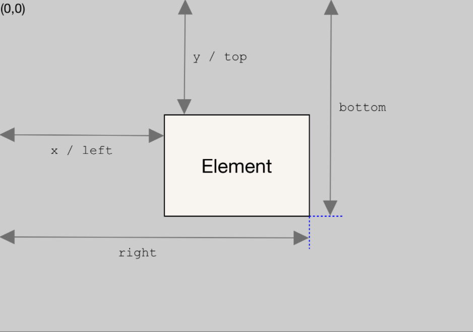

#### 6-2. Coordinates with scroll bar

- client X,Y: coordinate should be defined basd on documentElement of browser.

- page X,Y : coordinate should be defined based on whole page size itself.

##### 6-2-1. Display coordinates on special div

- ``

- In case you want to operate reactive values, use application and querySelector as below. If you use `getBoundingClientRect()`, the values would be displayed according to changed coordinate on div with class named "special" such as client X,Y and page X,Y.

- `<body>`
  `

`
  `

`
  `

`
  `

`
  `

`
  `

`
  `

`
  `

`
  `

`
  `

`
  ``
  `</body>`

- In case of all codes, Please refer file named `coordinate1.html`.

- If you do not want scrolling, add `overflow: hidden;` on body function in tag of style.

    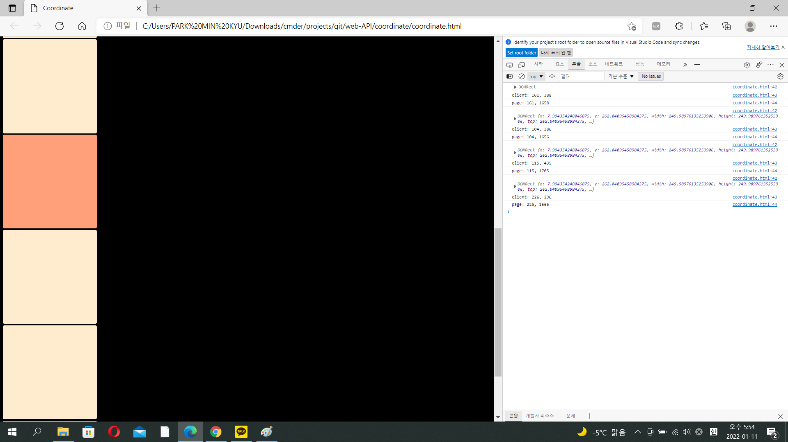

##### 6-2-2. Move coordinates with buttons

- Please add aside in tag of style as below to put buttons on position of aside.

- ``

- Please Use defined APIs such as scrollBy, scrollTo, scrollIntoView. `scrollBy` and `scrollTo` are method, `scrollIntoView` is property. So, in case use scrollIntoView, element as special is needed to operate as below.

- ``

- In case of all codes, Please refer file named `coordinate2.html`.

    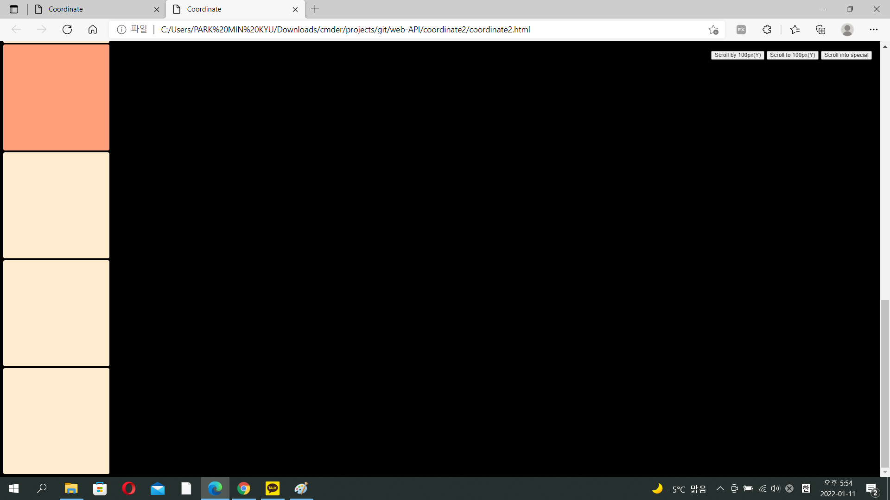

#### 6-3. Display coordinates with symbol icon and lines

- Please add sytle.css for decorating with symble and main.js for dynamic event values because of used complicated values except for tage of style on HTML.

- In case of HTML file, add line to display line. add classes named horizontal and verticle in line class to move the lines. Add target to display symbol icon and add tag to display span data.

`<body>`
`

`
`

`
``
``
`</body>`

- In case of all codes, Please refer file named `coordinate3.html`.

- In case of CSS file, position should be absolute to get fixed position. Top is same as client X and left is same as client Y. Use CSS function named transform to reposition symbol icon and span data. Symbol icon is needed parameters named top: -50%, left: 50% to put the icon on center.

- `body` {
  background-color: black;
  }
  `.line` {
  position: absolute;
  background-color: white;
  }
  `.horizontal` {
  width: 100%;
  height: 1px;
  top: 50%;
  }
  `.target` {
  position: absolute;
  top: 50%;
  left: 50%;
  transform: translate(-50%, -50%);
  }
  `.tag` {
  color: white;
  position: absolute;
  top: 50%;
  left: 50%;
  transform: translate(20px, 20px);
  font-size: 38px;
  }

- In case of all codes, Please refer file named `style.css`.

- In case of Javascript file, immutable variables should be defined relate with classes to oprate dynamically. Coordinates are displayed by below codes on documentElement of browser per event of mousemove.

- document.addEventListener(`'mousemove'`, (event) => {
  const X = event.clientX;
  const Y = event.clientY;
  `vertical.style.left` = `${X}px`;
  `horizontal.style.top` = `${Y}px`;
  `target.style.left` = `${X}px`;
  `target.style.top` = `${Y}px`;
  `tag.style.left` = `${X}px`;
  `tag.style.top` = `${Y}px`;
  `tag.innerHTML` = `${X}px, ${Y}px `;
  });

- In case of all codes, Please refer file named `main.js`.

    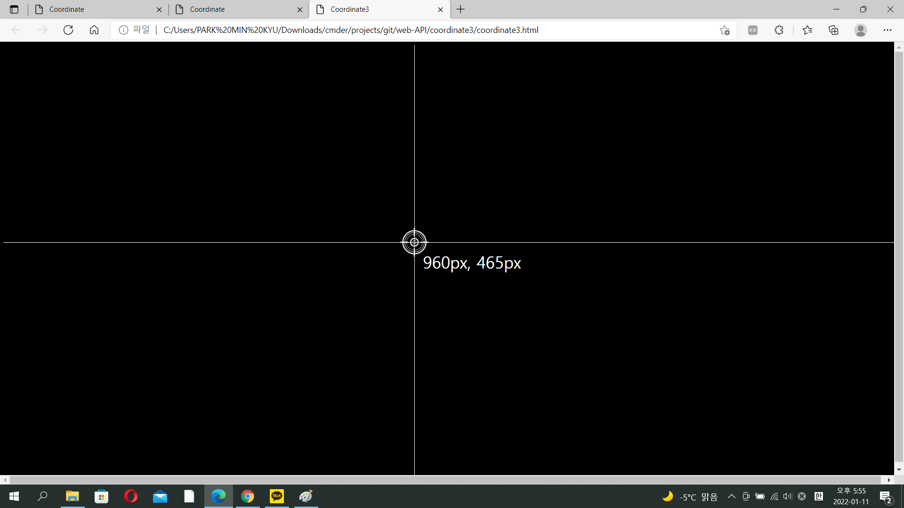

#### 6-4. Optimized coordinates with symbol icon and lines

- In fact, application of 6-3 use properties of layout, paint, composition stage. It would be bad choice for rendering. So, optimization is needed. HTML is same between 6-3 and 6-4.

- In case of CSS file, margin of body should be 0% to remove the margin if margin occur on window. CSS property named top and left do not need because javascript use transform except for top and left. Margin of .tag should be added. CSS property named transform would not used on CSS file if javascript use the transfrom.

- `body` {
  background-color: black;
  margin: 0%;
  }
  `.horizontal` {
  width: 100%;
  height: 1px;
  }
  `.vertical` {
  width: 1px;
  height: 100%;
  }
  `.target` {
  position: absolute;
  }
  `.tag` {
  color: white;
  position: absolute;
  margin: 20px;
  font-size: 38px;
  }

- Use addEventListener of load to operate when completed fetching and protect mis-operating. Mis-operating maybe come from not completely fetched HTML data. getBoundingClientRect(), targetRect.width, targetRect.height should be needed to display coordinates and move near default coordinates. CSS property named transform is generally used with translate fucntion on Javascript. Values of translate function could use targetRect.width, targetRect.height on Javascript.

- `window.addEventListener`('load', () => {
  const targetRect = target.getBoundingClientRect();
  const targetHalfWidth = targetRect.width / 2 ;
  const targetHalfHeight = targetRect.height / 2;
  `document.addEventListener`('mousemove', (event) => {
  const X = event.clientX;
  const Y = event.clientY;
  vertical.style.transform = `translateX(${X}px)`;
  horizontal.style.transform = `translateY(${Y}px)`;
  target.style.transform = `translate(${X-targetHalfWidth}px, ${Y-targetHalfHeight}px)`;
  tag.style.transform = `translate(${X}px, ${Y}px)`;
  tag.innerHTML = `${X}px, ${Y}px `;
  });
  });

    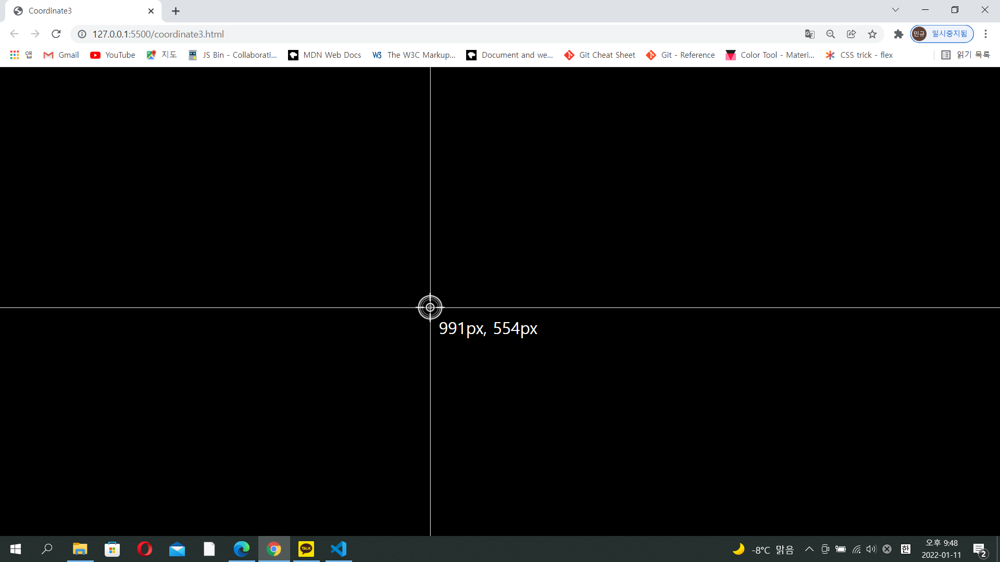

- Effort to optimize application would not only reduce delay when operating but also improve with high level coding skill. Performance tab of browser developer tool will help developer optimize their application indicating whether or not experience exist like layout shift.

### 7. Loading sequence on console

- In case of Web page, browser download resources in parallel such as image, font, javascript parsing HTML file. Option named defer would be better than others. Please refer operating sequence as below.
  Start to parse HTML file, and then, change DOM elements when tag of title. After parsing HTML completely, one of outputs named 'js loaded' is operated at first because of defer. Second output is DOMContentLoaded. Final output is load. DOMContentLoad deals with only document. Load deals with all resources such as CSS, images, and so on including document. So, speed of operate DOMContentLoad is faster than Load. In case of getting output when before exit page, use event type named beforunload. You could check output when refresh page. In case of getting output when exit page, use event type named unload.

- `<!DOCTYPE html>`
  `<html lang="en">`
  `<head>`
  `<meta charset="UTF-8">`
  `<meta name="viewport" content="width=device-width, initial-scale=1.0" >`
  `<title>Load</title>`
  ``
  `</head>`
  `<body>`
  ``

    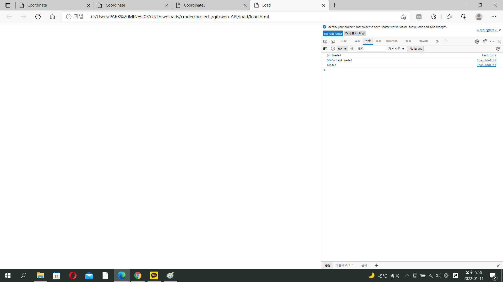

### 8. Find symbol of rabbit

- Add button named Find a rabbit and image with id named rabbit as below.

- `<body>`
  `<button>Find a rabbit</button>`
  ``
  `</body>`

- In case of symbol of rabbit with button, use function named `scrollIntoView` after variables named button and rabbit defined. use option of block: center if you want to put symbol of rabbit on center of documentElement of browser. rabbit is element of function named scrollIntoView.

- ``

- In case of decorating button and put icons on cener, function named button and body would be used as below. CSS function named text-align could place icons horizontally.

- ``

- In case of all codes, Please refer file named `index.html`.

    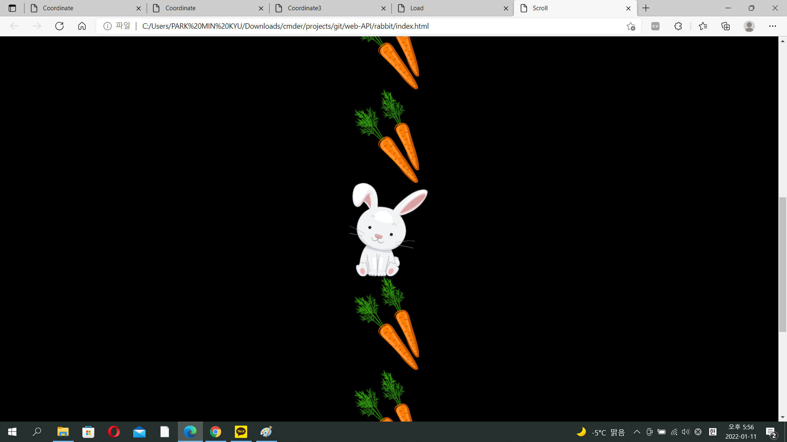

### 9. Add textcontent on window with created elements

- Return value of querySelector is element object representing first element in document. For example, output would be image when `const image = document.querySelector('img');`. Otherwise, in case you want to load what image you want regardless of sequence, add path like `img[src="img/green1.png"]` intead of `img`.

- In case you want to add created textContent at the end of line, use function named appendChild(paragraph element) after creating the paragraph element with function named createElement(tagname).

- `<body>`
  `<section>`
  ``
  `<h1 id="esg">`Green Energy`</h1>`
  `<h3>`Senario to limit increased temperature with global warming to 2 degrees`</h3>`
  `</section>`
  ``Hello!``
  ``
  `</body>`

- In case you want to add created textContent at the place where you want, use insertBefore(newnode, referencenode) after adding event variable to operate function named insertBefore correctly. The created event variable usually use with `insertBefore`, `appendChild`, `removeChild` when content of same tag should be changed many times. Otherwise, in case you want to change all contents to others on layer, use not only function named innerHTML but also $0.innerHTML on console directly.

- ``

    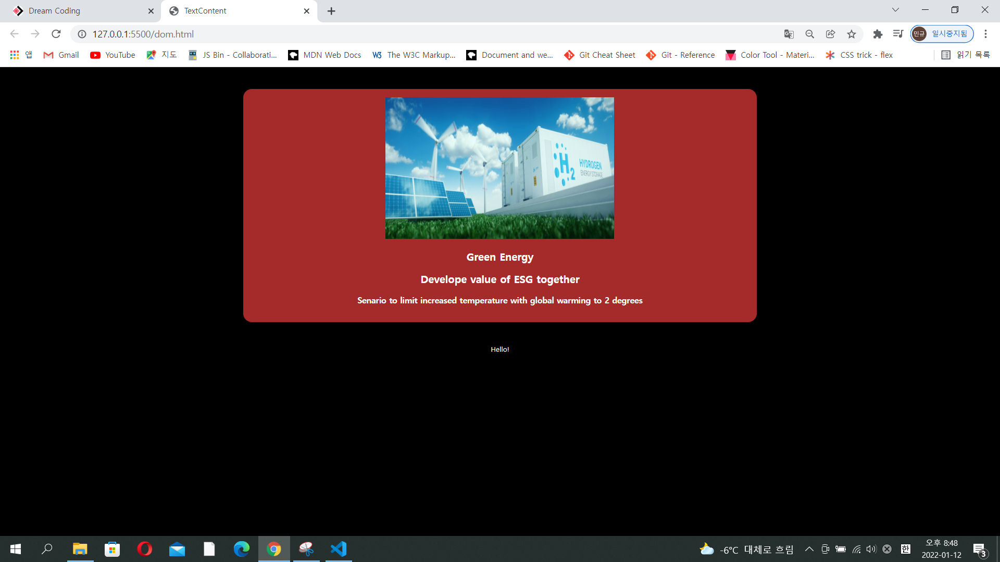

### 10. How to operate datas with API by browser

- Object named Node inherits object named EventTarget. So, Event could occur on node because node inherits EventTarget. Document or Element inherit node. So, Event could occur on Document or Element according to DOM tree.
  In addition, browsers creat DOM tree with HTML data to understand and ready to operate correctly itself. For example, TextNode inherits h1 and h1 is inherits section, section inherits body step by step. Please compare HTML codes with DOM tree and find matching connection.

    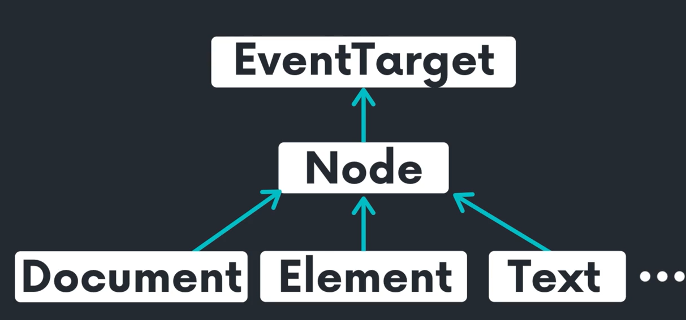

    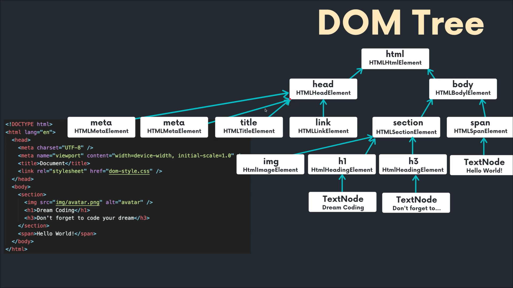

- EventTarget API offers 3 methods such as addEventListener(), removeEventListener(), dispatchEvent(). Element or Document also use the methods because element or document inherits node.
  Please refer https://developer.mozilla.org/en-US/docs/Web/API/Node and https://developer.mozilla.org/en-US/docs/Web/API/EventTarget.

- Rendering means getting input named HTML datas and transfer output for user see displayed datas on window. Please refer comprehensive rendering path as below.

    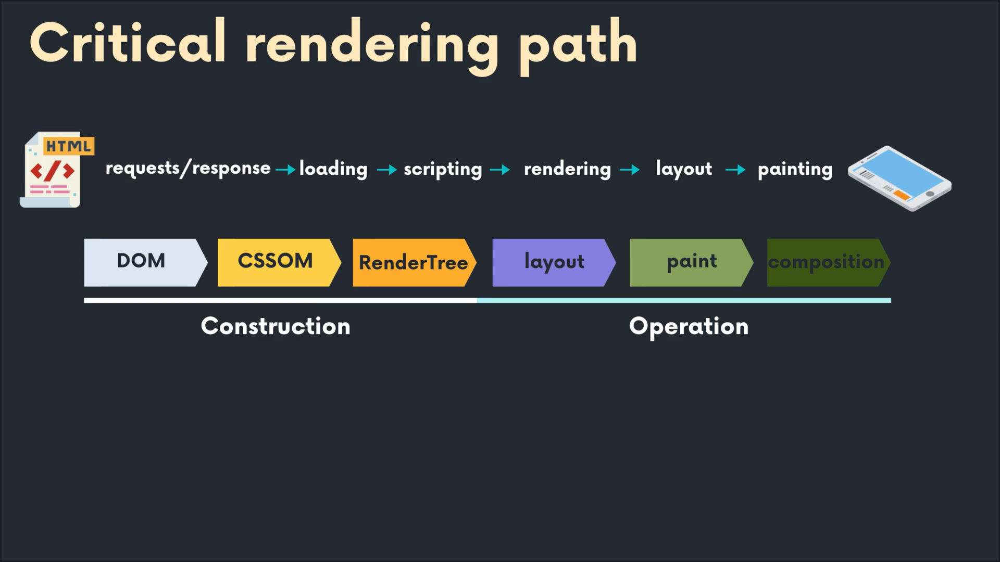

- Browser parse HTML datas on request/response stage and load DOMContent, resources on loading stage. Browser transforms loaded datas into objects named DOM, CCSOM on scripting stage. Browser creats render tree for direct user interface on rendering stage. Grouping request/response, loading, scripting, rendering stage is for browser to construct data trees for browser understand datas and ready to operate correctly.

- Browser calculates and defines their layout per output. layout information maybe includes coordinates, width, height, range, position, and so on regarding inline blocks and div blocks.
  Browser creats layers to paint. To fix some of datas quickly when user makes a fault, each range of paint is defined and applied to per layer on paint stage.

- In case whole paint area is defined on only one layer, browser should change all paint datas whenever some of datas are changed. Browser displays arranged layers complying with Z-index on composition stage. If some of arranged layers repositioning, it would be possible to be changed on only composition stage except for layout and paint stage.

- Please refer https://csstriggers.com indicating whether or not choosed CSS property is good. Blink is one of engine on chrome. Gecko is one of engine on firefox. Webkit is one of engine on iOS and safari. EdgeHTML used to be one of engine on older edge browser and up-to-date edge browser use blink engine same as chrome. It would be bad choice of property if use layout, paint, composition stage. Try to use efficient property with less change such as only changed composition or changed paint and composition. For example, browser should use layout, paint, composition stage many times if values of property named `top` and `left` are changed. So, use property named `transform` to use only composition stage.

#### 10-1. DOM tree

- DOM: document object model. DOM mean HTML data is transformed into document object according to DOM tree. For example, tags of HTML is transformed to node of javascript by browser.

    

#### 10.2 CCSOM tree

- CCSOM: CCS object model. CSSOM creats another tree in which tag of style on HTML or CSS file are transformed into CCS object according to DOM tree. CSSOM has computed style with cascading rules.

    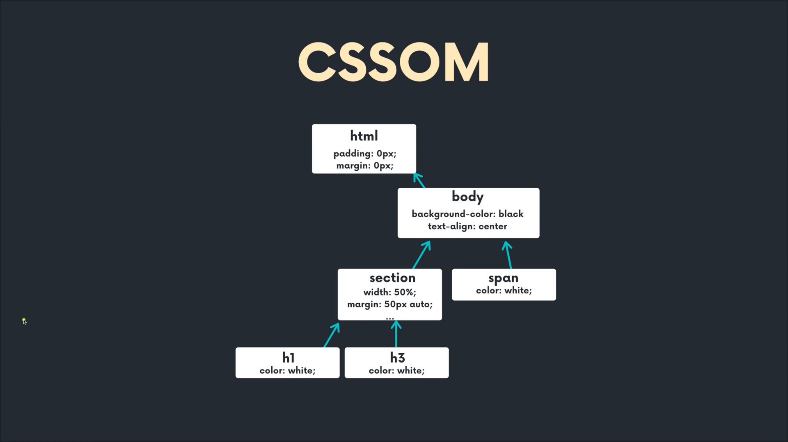

#### 10.3 Render Tree

- Render tree means tree combined with DOM tree and CCSOM tree.
  The render tree do not include meta datas like tag of head that help better buliding up structures for stable.

    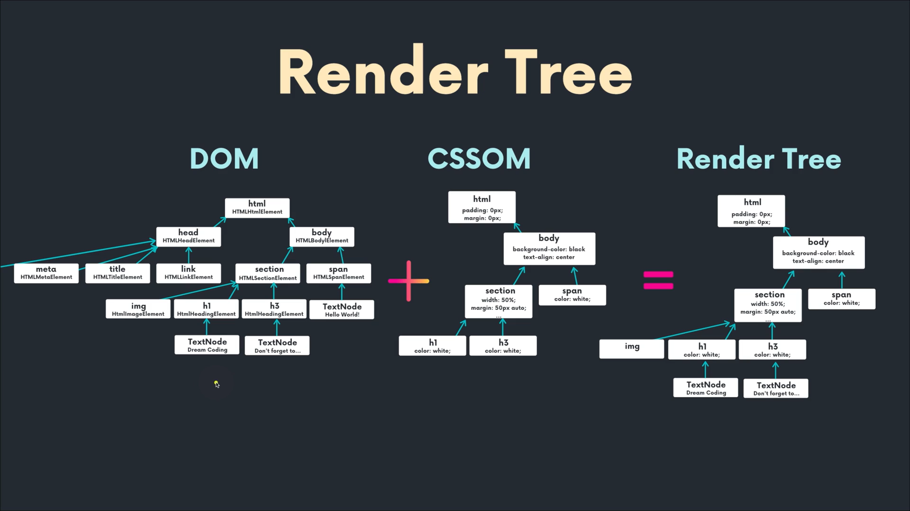

- In case tag of span has 0 value of opacity and hidden value of visibility, user can not see span data on window even though render tree has span data.

    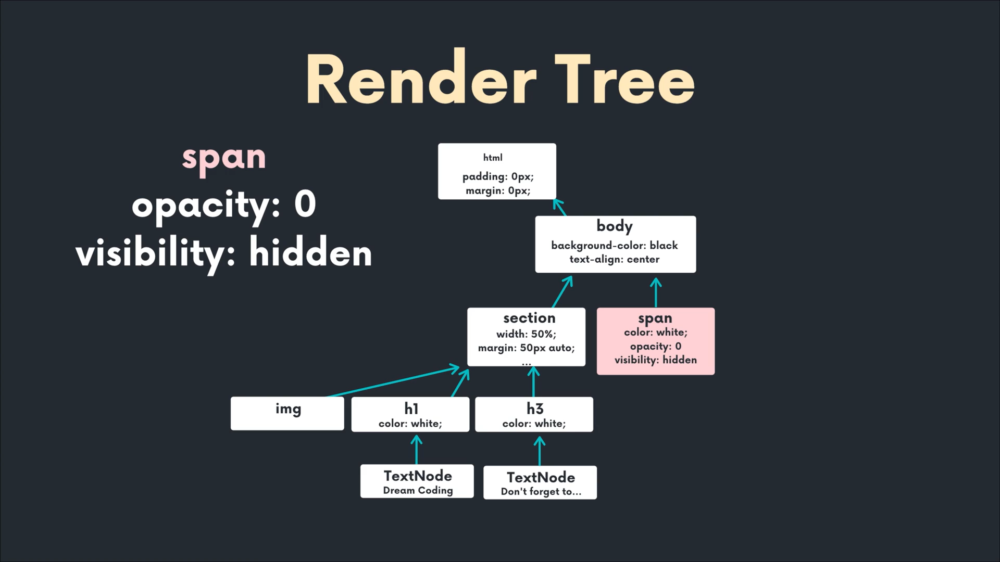

- In contrast, in case span has none value of display, user can not see span data on window and render tree also do not have span data.

    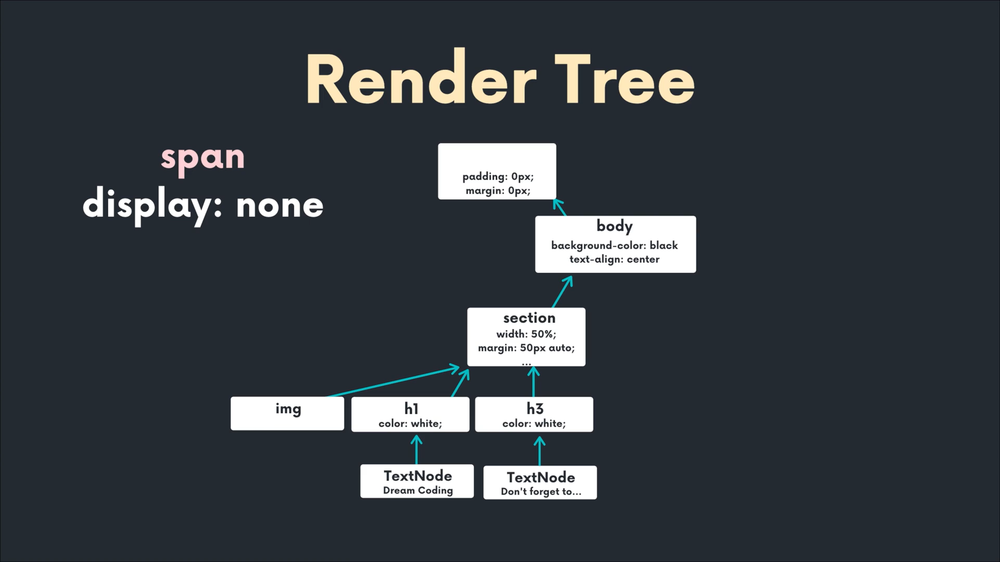

### 11. Shopping list

#### 11-1. HTML file

- In case you want to load icons from website named font awesome, use ``. This code could be received on your emial after register for ID on the website and connect with your email.

- Section should be assigned at first because of using some of section place on window tab. Tags named `header`, `ul`, `footer` should be assigned from section space. Tag named `li` should be assigned to add or delete shopping lists. In case space should be needed to add text or icon, add tag named `div` at first, and then, define tags named not only `span` but also `button`. Each class helps developer to decorate and control styling per tag efficiently when conncection with css file.

- `<section class="list">`
  `<header class="header">Shopping list</header>`
  `<ul class="items">`
  `<li class="item__row">`
  `
`
  `Egg`
  `<button class="item__button">`
  `<i class="fas fa-trash-alt"></i>`
  `</button>`
  `
`
  `</li>`
  `

`
  `</ul>`
  `<footer class="footer">`
  `<input type="text" class="footer__input">`
  `<button class="footer__button">`
  `<i class="fas fa-plus"></i>`
  `</button>`
  `</footer>`
  `</section>`

- In case of all codes, Please refer file named `shopping.html`.

#### 11-2. CSS file

- Box sizing should be defined on global scope at first to place boxes on same alignment of boxes. If not defined box sizing, in case you want to use input and define padding, size of input is wider than other boxes. CSS property named `text-align` controls position of text per box. CSS property named `justify-content` controls position on main axis. CSS property named `align-items` controls position on opposite axis. In case you use `display: flex` `and flex-direction: column`, main axis and opposite axis should be changed each other. In addition, use CSS properties on class of box in which div created or related to certain space directly if you want to apply to the space. For example, width should be applied to class named `.list` to place same alginment and height should be applied to class named `.items` to use height only on tag named `ul` except for `header` and `footer`. For second example, justify-content should be applied to class named `.item` because of empty box named `div`. `.item` is parent class of child classes named `.item__name` and `.item__button`. Please remind those.

- In case you want gradient color, Please refer https://cssgradient.io/.

- `*` {
  `box-sizing`: border-box;
  }
  `ul` {
  `padding`: 0;
  }
  `body` {
  `text-align`: center;
  `background-color`: #ced3df;
  }
  `button` {
  `background`: transparent;
  `border`: none;
  `outline`: none;
  `cursor`: pointer;
  }
  `.list` {
  `width`: 400px;
  `background-color`: #f1f0f7;
  `border-radius`: 20px;
  `margin`: auto;
  }
  `.items` {
  `height`: 500px;
  `overflow-y`: auto;
  `margin`: 0px;
  }
  `.header` {
  `height`: 48px;
  `color`: white;
  `font-size`: 34px;
  `background`: rgb(240, 156, 86);
  `background`: linear-gradient(
  14deg,
  rgba(240, 156, 86, 1) 0%,
  rgba(234, 245, 97, 1) 22%,
  rgba(144, 235, 224, 1) 45%,
  rgba(0, 212, 255, 1) 100%
  );
  `border-radius`: 20px 20px 0 0;
  }
  `.footer` {
  `height`: 90px;
  `background`: rgb(240, 156, 86);
  `background`: linear-gradient(
  14deg,
  rgba(240, 156, 86, 1) 0%,
  rgba(234, 245, 97, 1) 22%,
  rgba(144, 235, 224, 1) 45%,
  rgba(0, 212, 255, 1) 100%
  );
  `border-radius`: 0 0 20px 20px;
  `display`: flex;
  `flex-direction`: column;
  `justify-content`: space-between;
  `align-items`: center;
  }
  `.item` {
  `display`: flex;
  `justify-content`: space-between;
  `font-size`: 24px;
  `align-items`: center;
  `padding`: 8px 32px;
  }
  `.item__row` {
  `list-style`: none;
  }
  `.item__button` {
  `transition`: all 300ms ease-in;
  `font-size`: 18px;
  }
  `.item__button:hover` {
  `color`: red;
  `transform`: scale(1.3);
  }
  `.item__divider` {
  `width`: 90%;
  `height`: 2px;
  `background-color`: lightgray;
  `margin`: auto;
  }
  `.footer__input` {
  `width`: 100%;
  `height`: 32px;
  `outline`: none;
  `border`: none;
  `margin`: 0px;
  `padding`: 0 16px;
  `font-size`: 24px;
  }
  `.footer__button` {
  `width`: 48px;
  `height`: 48px;
  `background-color`: black;
  `color`: white;
  `border-radius`: 50%;
  `font-size`: 24px;
  `transition`: transform 300ms ease-in;
  `margin-bottom`: 4px;
  }
  `.footer__button:hover` {
  `transform`: scale(1.3);
  }

- In case of all codes, Please refer file named `style.css`.

#### 11-3. Javascript file

- According to input.value, each of shopping lists is added with trash icon button when footer button is clicked. Each of shopping lists would be deleted when trash icon button is clicked. This is concept of operating shopping list. Element directly related to event such as clicking button, enter text on input tab should be defined on javascript with `document.querySelector()`.

- Please refer architecture of HTML tags and try to understand connection between parent node and child node. `ul` tag with class named `items` contains `li` tag with class named `item__row` and `div` tag with class named `item__divider`. `li` tag with class named `item__row` contains `div` tag with class named `item`. `div` tag with class named `item` contains `span` tag with class named `item__name` and `button` tag with class named `item__button`. Their correlation of tags is important to use api functions and innerHTML. This means understanding of architecture is very important to use javascript for correct operation when using with `element.createElement()` and `element.setAttribute()`.

- Define variable related to `querySelector` if you want to change the variable when dynamic condition at first. Function named `onAdd()` contains variables related with `input.value` and `createItem(text);` and could initialize input. Function named `createItem()` contains variables related to virtual tag with class for a use on dynamic condition. The variables are related with classes named `item__row`, `item__divider`, `item`, `item__name`, `item__button`. `itemRow.appendchild(item);` would be used to add text of list and trash icon because container is needed to include the text and icon. `itemRow.appenchild(itemDivider);` would be used to add line of divider. In addition, variable named `itemRow` is defined on function named `onAdd()` and connection with node named `items` using `items.appendChild(itemRow);` on function `onAdd()`. In case you want to protect uploading with empty value and ready to cursor on input tab, use `if (input.value === ''){input.focus()}` after `const text= input.value;`. In case you want to upload values through not only clicking footer button but also entering input tab, use `addBtn.addEventListener('click', ()=> { onAdd();})` and `input.addEventListener('keypress', ()=> {if(event.key === 'Enter'){ onAdd();}})` respectively. In addition, defined return value is important because return value is not only output of the function but also input of other function.

- `const items = document.querySelector('.items');`
  `const input = document.querySelector('.footer__input');`
  `const addBtn = document.querySelector('.footer__button');`

- `function onAdd()` {
  `const text = input.value;`
  `if (input.value === '')`{
  input.focus();
  return;
  }
  `const itemRow = createItem(text);`
  `items.appendChild(itemRow);`
  `item.scrollIntoView({block : 'center'});`
  `input.value = '';`
  `input.focus();`
  }

- `function createItem (text)` {
  `const itemRow = document.createElement('li');`
  `itemRow.setAttribute('class', 'item__row');`
  `const itemDivider = document.createElement('div');`
  `itemDivider.setAttribute('class', 'item__divider');`
  `const item = document.createElement('div');`
  `item.setAttribute('class', 'item');`
  `const itemName = document.createElement('span');`
  `itemName.setAttribute('class', 'item__name');`
  `itemName.innertext = text;`
  `const itemBtn = document.createElement('button');`
  `itemBtn.setAttribute('class', 'item__button');`
  itemBtn.innerHTML = `<i class="fas fa-trash-alt"></i>`
  `itemBtn.addEventListener`('click', ()=> {
  items.removeChild(itemRow);
  });
  `itemRow.appendChild(item);`
  `itemRow.appendChild(itemDivider);`
  `item.appendChild(itemName);`
  `item.appendChild(itemBtn);`
  `return itemRow;`
  }
- `addBtn.addEventListener`('click', () => {
  onAdd();
  })
  `input.addEventListener`('keypress', event => {
  `if(event.key === 'Enter')`{
  onAdd();
  }
  })

- In case of all codes, Please refer file named `main.js`.

#### 11-4. Output

- 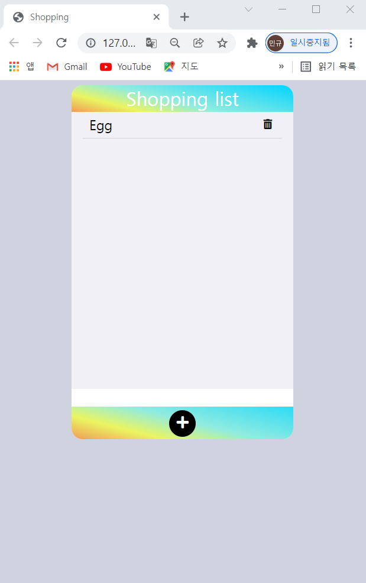

  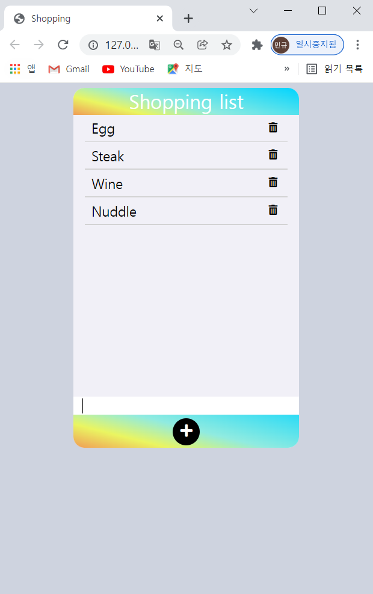

#### 11-5. Optimized shopping list with event delegation

- `const itemDivider = document.createElement('div');`
  `itemDivider.setAttribute('class', 'item__divider');`
  `const item = document.createElement('div');`
  `item.setAttribute('class', 'item');`
  `const itemName = document.createElement('span');`
  `itemName.setAttribute('class', 'item__name');`
  `itemName.innertext = text;`
  `const itemBtn = document.createElement('button');`
  `itemBtn.setAttribute('class', 'item__button');`
  itemBtn.innerHTML = `<i class="fas fa-trash-alt"></i>`

- string template means `. Same output comes from codes of upper and lower. The goal of ${id} is to get output with specified icon except for other icon.

  - `itemRow.innerHTML` = `string template`
    `
`
    ``${text}``
    `<button class="item__button" >`
    `<i class="fas fa-trash-alt"` `data-id=${id}>`` </i>` `</button>` `
` `
 ``
` `string template;`

- Use parent node with event.target for event delegation. use `if(id) {toVedelete.remove();}` to remove box of item when clicking on specified icon among some space of items. Console tab helps user find selector for querySelector. For example, type items.querySelector('`.item__row[data-id="0"]`'); and then you could get output related to `li` tag with class named `item**row` and the id. This path should be applied to the variable that could delete the list of box named `item`.

- `items.addEventListener`('click', event => {
  `const id` = `event.target.dataset.id;`
  if(id) {
  `const toBedelete` = document.querySelector(`.item__row[data-id ="${id}"]`);
  `toBedelete.remove();`
  }
  })

- In case of all codes, Please refer file named `main2.js`.

### 12. Event

- Event notifies codes of changes that may affect code operation. The event is used with parameter of method function and variable for correct output on form of DOM tree and javascript. There are many type of event interfaces such as using mouse or resizing window tab or changes in the state of underlying environment like low battery or any other cause. Please refer https://developer.mozilla.org/ko/docs/Web/Events for good understanding of event types.

#### 12-1. Event handler

- Web API has event handler and event handler helps browser engine operate correct output. For example, event would be called from broser engine with event handler when certain dynamic condition. EventTarget of DOM tree is used when event occur, according to DOM tree, element or document could be used as same as eventtarget. So, all elements with method function could event handler. EventTarget has 3 types of API such as `EventTarget.addEventListerner()`, `EventTarget.removeEventListener()`, `EventTarget.dispatchEvent()`. `removeEventListener()` should be used with defined variable Listener. The variable is used on not only `addEventListener()` but also `removeEventListener()`. `dispatchEvent()` would be used to creat artificial event like `$0.dispatchEvent(new Event('click'));`. However, `addEventListerner()` should be defined already to get correct output with `dispatchEvent()`.

  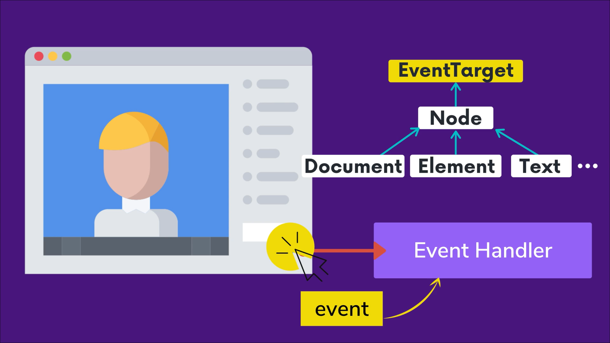

#### 12-1-1. Capturing and Bubbling

- Browser controls capturing stages itself. So developer could control bubbling stages with event handler, rather than control capturing stages.

- 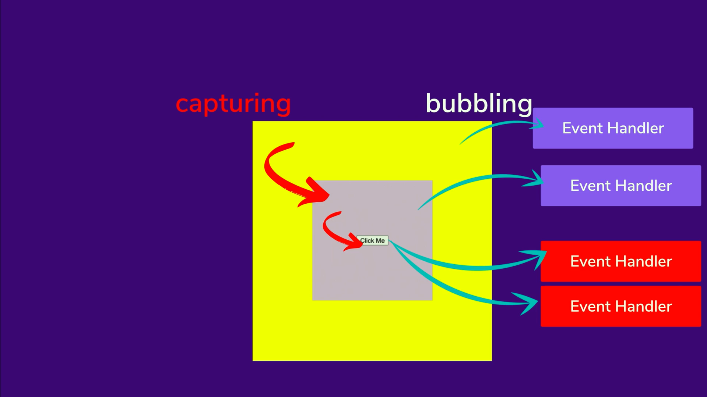
  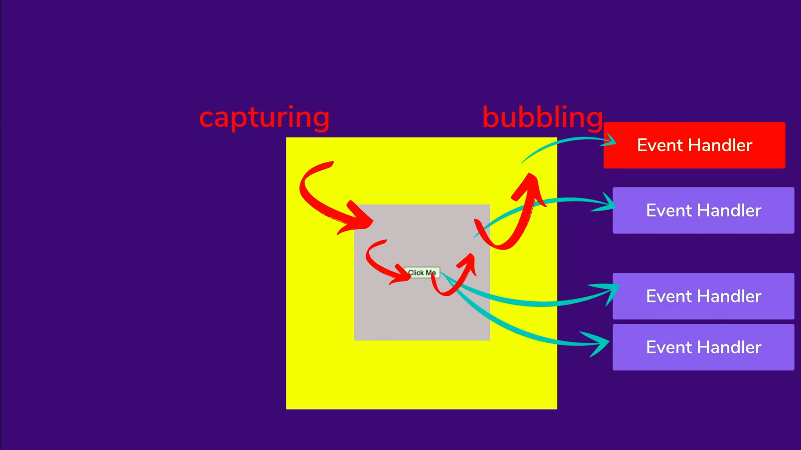

- The event handler should be applied to per output like button1, button2 even though variable related to button1, button2 is only one. In addition, use conditional function named `If( !== )`, rather than `event.stopPropagation();` and `event.stopImmediatePropagation();`.
  In case other functions may use event of clicking button, event handler of other functions could not use the event and could not get correct output because the event is stopped on function written down `stopPropagation()` or `stopImmediatePropagation()`. In case of using `If( !== )`, event handler of other functions could use the event and get correct output.

- ``

    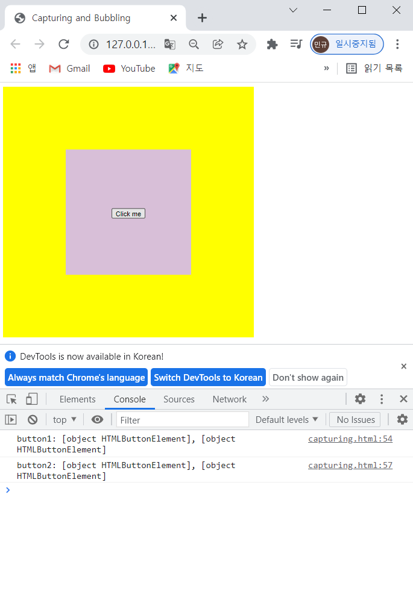

#### 12-2. Prevent operation from happening on browser

- In case you should check methods connection with other function in detail regarding event, you could use `event.preventDefault();`. browser can prevent operation of the function from happening on browser if use `event.preventDefault()` in the function. console.log() could be printed on console tab. In case of type named `wheel`, addEventListener is passive event listener. `event.preventDefault();` can not used with console warning because the passive event listener has target treated as passive. The passive event listener means browser outputs without waiting for other activities within the function in case feedback of this event should be actived very quickly like scrolling. However, In case you use option named `{passive: false}`, `event.preventDefault()` can be operated, but, you may find root cause related to passive event listener when your deburgging. So, `{passive: true}` is recommended. In case of normal event listener like type named `click`, `event.preventDefault()` ouputs correctly because browser waits enough for other acitivities within the function.

- ``

    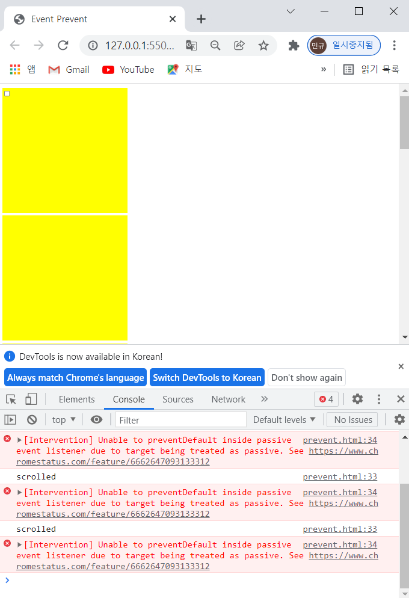

#### 12-3. Event delegation from parent node rather than all elements on current node with for loop

- According to bubbling stages, parent container could use event occurred on each of child elements.

- Change background-color to yellow when clicking the list.

- Parent node named `ul` should be defined on javascript to use `ul.addEventListener()`. In case class should be added for contents with tag named `style` are applied to, use `classList.add()` with `event.target` to use event target on parent node instead of `event.currentTarget`.

- In case of bad built code, all elements are searched and affected some of elements are applied to as below. `document.querySelectorAll()` should be used to creat array for function named `forEach()`.

- `const lis` = `document.querySelectorAll('li');`
  `lis.forEach`(`li` => {
  li.addEventListener('click', () => {
  `li.classList.add('selected');`
  });
  })

- In case of good built code, event delegation is used to get one of event target and operated normally. `ul` is defined to get one of event target on parent node instead of current node. class named `.selected` is added with `classList.add('selected');` to apply to yellow color using tag named `style`.

- `const ul` = document.querySelector('ul');
  ul.addEventListener('click', event => {
  `event.target`.`classList.add('selected');`
  })

    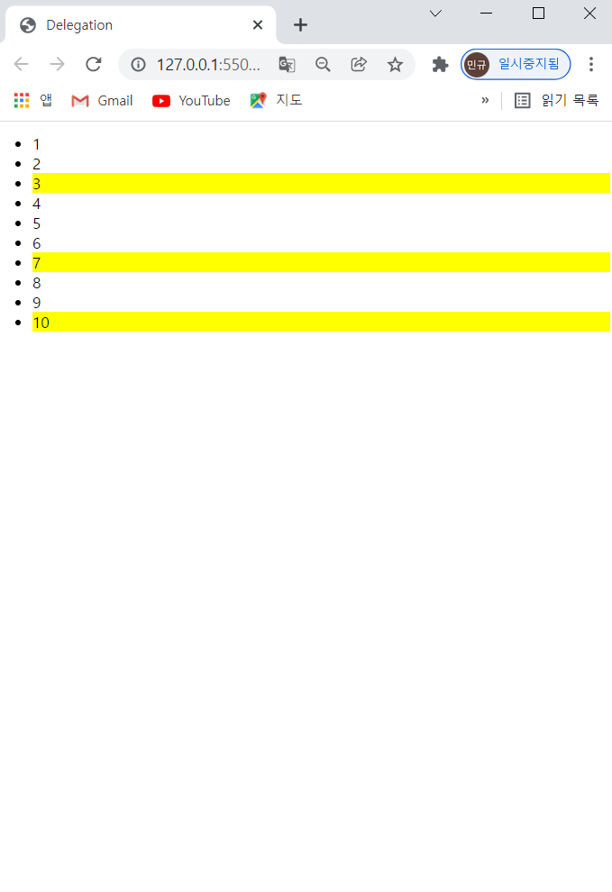

### 13.Resolution of failures

- symptom: stangeous values of winow.inner, document.documentElement even though application operate without error. I do not know root cause why browser engine operate trash values. I will check...

    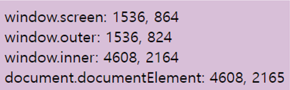

- countermeasure: type window.inner or document.documentElement on console tap of browser. In case of stangeous values come from browser engine, would be fixed correctly.

    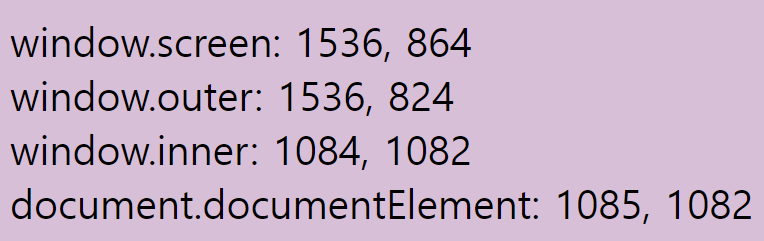

- symptom: textcontent of heading2 is not operated on window with `Uncaught TypeError: Cannot read properties of null (reading 'setAttribut')` when use function named setattribute to creat attribute named class on tag of heading2. Element named h2 is not created because I do not use createElement to add tag of HTML. I mis-use querySelector so type error occurred bacause tag named h2 did not exist and there is not input of setAttribut. QuerySelector just return value of querySelector whenever event. The value would be element object representing first element in document.

    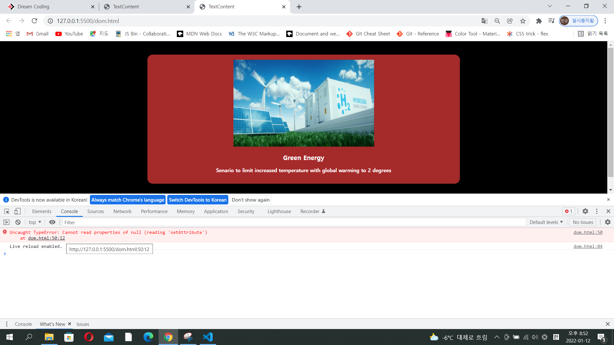

- countermeasure: replace `const h2 = document.querySelector('h2');` with `const h2 = document.createElement('h2');`

- symptom: pointer of cursor do not oprated on button of application named 'Find symbol of rabbit'. I do not know root cuase why broswer engine do not operate correctly. I will check...

- countermeasure: selector of queryselector replace `'button'` with `'.button'` and save and restore to change already assigned memory like `const button = document.querySelector('.button');`. Another is that add class on tag of button and save and restore changed tag of button like `<button class="buttons">Find a rabbit</button>`. It would be operated correctly.

- symptom: there is difference a little bit when clicking footer button and entering on input tab. In case of clicking button, new item could be uploaded on same place at point where screen looks at you. In contrast, in case of entering on input tab, the point is changed to top of box where screen looks at you.

- Clicking footer button
  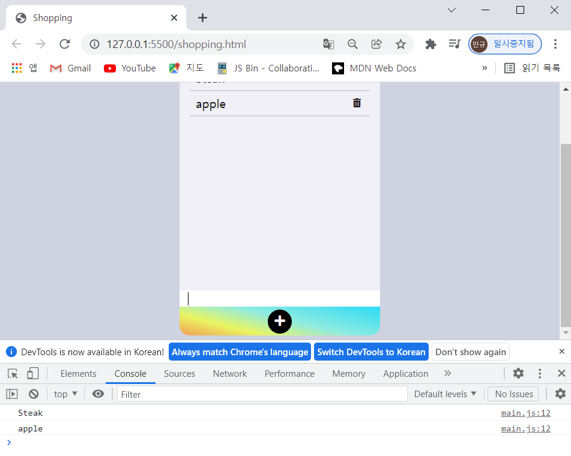
  Entering on input tab
  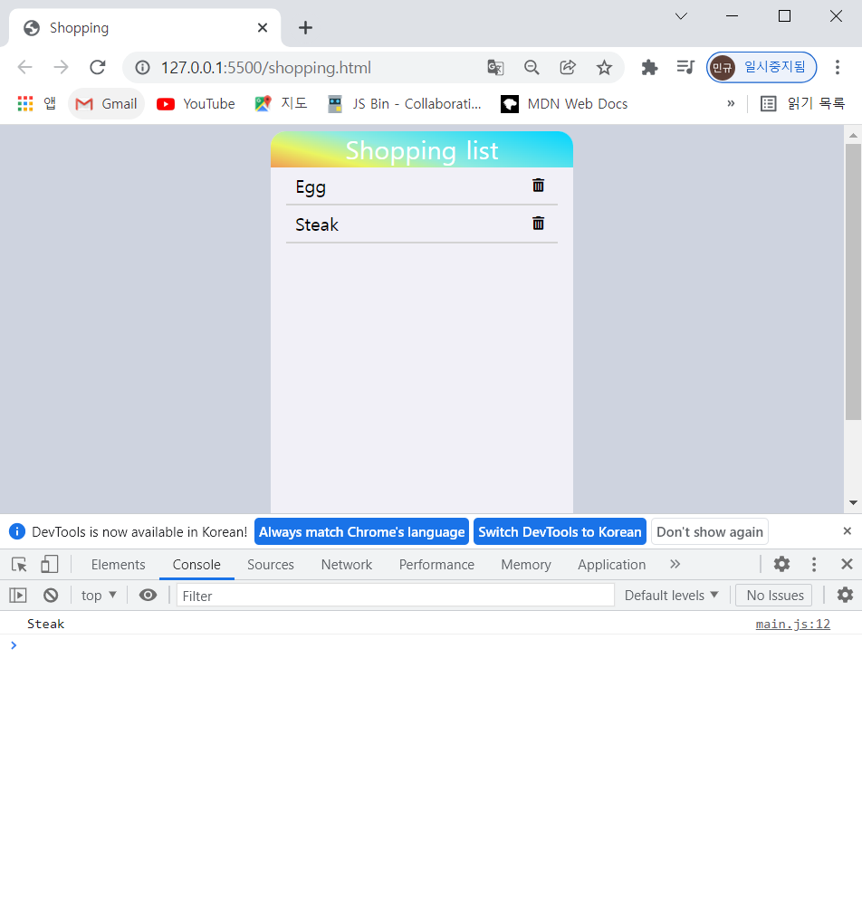

- countermeasure: I will check...
